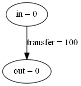
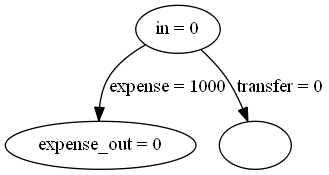
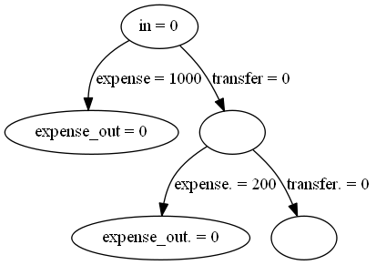

# zaigen

_zaigen is a simulator for personal financial planning_

## Description

zaigen is a python package intended to enable simple personal financial simulation and forecasting. zaigen is based on a graph data structure where nodes represent the sources/sinks/locations of money and the edges represent transfers of money between the nodes.

### Low level data structures

We can make a simple graph in zaigen using the basic `Node` and `Edge` classes. These are then put in to a `Graph` object to manage the graph and updates.

```python
import zaigen

# Define the nodes and edges
in_node = zaigen.Node('in')
out_node = zaigen.Node('out')
transfer = zaigen.Edge('transfer',
                        in_node,
                        out_node,
                        100)

# Add them to the graph object
g = zaigen.Graph()
g.add_node(in_node)
g.add_node(out_node)
g.add_edge(transfer)
zaigen.viz.show_graph(g, 'docs/simple_graph')
```

The above produces the following graph:



### High level graph construction

In order to simplify the process of constructing a graph to represent the flow of money in the simulation there are a series of helper functions to add typical financial elements such as:

- Pension
- Tax
- Expenses
- Salary

For example if we want to add an expense to an existing graph we can use the `add_expense` function, passing in the graph to modify and the value of the expense. Something about how this wouldn't operate on an empty graph.

```python
# Create a graph, we also need to add node in order to connect the expense
graph = zaigen.Graph()
graph.add_node(zaigen.Node('in'))

zaigen.helpers.add_expense(graph, 1000)
zaigen.viz.show_graph(graph, 'expense_example')
```

The above appends an expense to the `in` node to produce the following graph:



The helper function also adds a transfer to a new 'intermediate' node. This transfer will take all the remaining funds from the previous node and move them to the intermediate, this helps to make the ordering of transactions in the graph clear. This new intermediate node is then set to the 'current_node' of the graph, and is the node to which helper functions will extend from. For example, if we create a second expense, we will end up with a graph which looks like:

```python
zaigen.helpers.add_expense(graph, 200)
zaigen.viz.show_graph(graph, 'expense_example_2')
```



## Edge weights and node values

Edges represent transfers of money between nodes. These could be transfers from a source (such as salary income), to a sink (such as an expense), to an asset (such as savings), or just the flow of money through the graph.

## Updating the graph

To step the simulation forward call the graph method `update` to progress by one unit of time. This will update all the weights of the edges as well as propagate money through the system. Be aware that some edges update their weights based on the initial value of the node, and some on the final value. Also the ordering of edges added to the graph is important e.g. when using a `Remaining` weight.

## TODO

- Transfer weights (types of transfer)
- Changing over time using a schedule
- Joining graphs
- Plotting
- Current node
