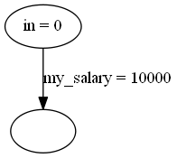

# Helpers

zaigen provides various helper functions to construct graphs relating to common financial patterns. These typically extend an existing graph and are used to construct a graph for simulation.

The helpers available in zaigen are:

- [salary](#salary)
- [pension](#pension)
- mortgage
- tax
- expense
- final savings

## Salary

The salary is typically the primary inflow for working age graphs. The salary helper function will add a new source node and set up a regular lump sum payment to an intermediate node, which will become the current node of the graph.

## Pension

A pension constructs a typical workplace defined contribution pension. Money is taken from salary before tax, a contribution is made from a new source node to represent employer contribution, and interest is earned on the pension pot.

